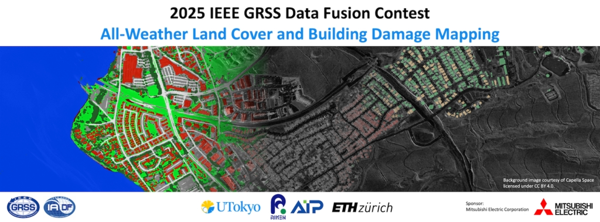
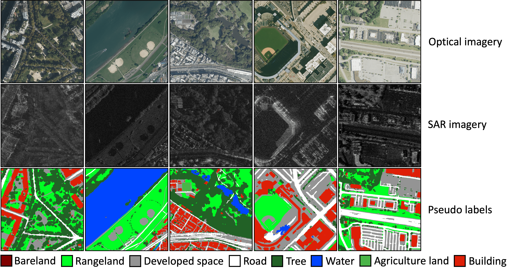

<div align="center">

<p></p>
</div>

<div align="justify">
<p>The 2025 IEEE GRSS Data Fusion Contest, organized by the Image Analysis and Data Fusion Technical Committee, the University of Tokyo, RIKEN, and ETH Zurich, aims to foster the development of innovative solutions for all-weather land cover and building damage mapping using multimodal SAR and optical EO data at submeter resolution. The contest comprises <b>two tracks</b>: <em>land cover mapping</em> and <em>building damage mapping</em>.
This repository contains the baseline model for the <b>Track 1 challenge: All-Weather Land Cover Mapping</b>.</p>
</div>
 
<div align="center">
	
[](https://github.com/Naereen/StrapDown.js/blob/master/LICENSE)
<a href="https://pytorch.org/get-started/locally/"></a>

</div>

## 2025 IEEE GRSS Data Fusion Contest Track 1 : All-Weather Land Cover Mapping
<div align="justify">
<p>
The Track 1 challenge focuses on developing methods for land cover mapping in all weather conditions using SAR data. The training data consists of multimodal submeter-resolution optical and SAR images with 8-class land cover labels. These labels are pseudo-labels derived from optical images based on pre-trained models. During the evaluation phase, models will rely exclusively on SAR to ensure they perform well in real-world, all-weather scenarios. It aims to improve the accuracy of land cover mapping under varying environmental conditions, demonstrating the utility of SAR data in monitoring land cover. The mean intersection over union (mIoU) metric is used to evaluate the performance.
</p> 
<p>

**Get involved! Check out the following links:** </br>
- Challenge webpage [2025 IEEE GRSS Data Fusion Contest](https://www.grss-ieee.org/technical-committees/image-analysis-and-data-fusion/?tab=data-fusion-contest)
- Dataset download [https://zenodo.org/records/14622048](https://zenodo.org/records/14622048) 
- Submission portal [https://codalab.lisn.upsaclay.fr/competitions/21121](https://codalab.lisn.upsaclay.fr/competitions/21121)
</p>
</div>

## Dataset
<div align="justify">

The dataset for the Track 1 challenge is OpenEarthMap-SAR. The [OpenEarthMap-SAR](https://zenodo.org/records/14622048) is a synthetic aperture radar dataset benchmark with [OpenEarthMap](https://open-earth-map.org/) optical data for global high-resolution land cover mapping. It consists of 5033 images at a 0.15–0.5m ground sampling distance covering 35 regions from Japan, France and the USA; and with partially manually annotated labels and fully pseudo labels of 8 land cover classes. A detailed description of the dataset can be found [here](https://zenodo.org/records/14622048), where it can also be downloaded. Below are examples of the OpenEarthMap-SAR dataset.

<p></p>
</div>

## Baseline
<div align="justify">

The UNet architecture with EfficientNet-B4 encoder from the [Segmentation Models Pytorch](https://github.com/qubvel/segmentation_models.pytorch?tab=readme-ov-file) GitHub repository is adopted as a baseline network.
The network was pretrained using the *train set* of the OpenEarthMap-SAR dataset. Download the pretrained weights from [here](https://drive.google.com/file/d/1Myd8b2KVFRuYVPyjB6EAv70OsNmjtgB9/view?usp=sharing).

## Usage
<div align="justify">

The repository structure consists of a configuration file that can be found in `config/`; data splits for each set in `data/`; and  all the codes for the GFSS task are in `src/`. The testing script `test.sh` is at the root of the repo.
The `docs` folder contains only GitHub page files.

To use the baseline code, you first need to clone the repository and change your directory into the `OEM-Fewshot-Challenge` folder. Then follow the steps below:</br>
1. Install all the requirements. `Python 3.9` was used in our experiments. Install the list of packages in the `requirements.txt` file using `pip install -r requirements.txt`.
2. Download the dataset from [here](https://zenodo.org/records/10591939) into a directory that you set in the config file `oem.yaml`
3. Download the pretrained weights from [here](https://drive.google.com/file/d/1Myd8b2KVFRuYVPyjB6EAv70OsNmjtgB9/view?usp=sharing) into a directory that you set in the config file `oem.yaml`
4. In the `oem.yaml` you need to set only the paths for the dataset and the pretrained weights. The other settings need not be changed to reproduce the results.
5. Test the model by running the `test.sh` script as mentioned in the **Baseline** section. The script will use the *support_set* to adapt and predict the segmentation maps of the *query_set*. After running the script, the results are provided in a `results` folder which contains a `.txt` file of the IoUs and mIoUs, and a `preds` and `targets` folder for the predicted and the targets maps, respectively.

You can pretrained your model using the *trainset* and any simple training scheme of your choice. The baseline paper used the [`train_base.py`](https://github.com/chunbolang/BAM/blob/main/train_base.py) script and base learner models of [BAM](https://github.com/chunbolang/BAM) (see the [baseline paper](https://github.com/sinahmr/DIaM?tab=readme-ov-file) for more info).


 Then, the state-of-the-art framework called [distilled information maximization](https://arxiv.org/abs/2211.14126) 
(DIaM) was adopted to perform the GFSS task. The code in this repository contains only the GFSS portion. As mentioned by the baseline authors, any pretrained model can be used with their framework. 
The code was adopted from [here](https://github.com/sinahmr/DIaM?tab=readme-ov-file). To run the code on the *valset*, simply clone this repository and change your directory into the `OEM-Fewshot-Challenge` folder which contains the code files. Then from a terminal, run the `test.sh` script. as:
```bash
bash test.sh 
```
</div>

## Citation
<div align="justify">
For any scientific publication using this data, the following paper should be cited:
<!--<pre style="white-space: pre-wrap; white-space: -moz-pre-wrap; white-space: -pre-wrap; white-space: -o-pre-wrap; word-wrap: break-word;">
@misc{bronibediako2024GFSS,
      title={Generalized Few-Shot Semantic Segmentation in Remote Sensing: Challenge and Benchmark}, 
      author={Clifford Broni-Bediako and Junshi Xia and Jian Song and Hongruixuan Chen and Mennatullah Siam and Naoto Yokoya},
      year={2024},
      note={arXiv:2409.11227},
      url={https://arxiv.org/abs/2409.11227}, 
}
</pre>-->
</div>

## Acknowledgements
<div align="justify">

We are most grateful to the authors of [Semantic Segmentation PyTorch](https://github.com/qubvel/segmentation_models.pytorch?tab=readme-ov-file) from which the baseline code is built on.
</div>
